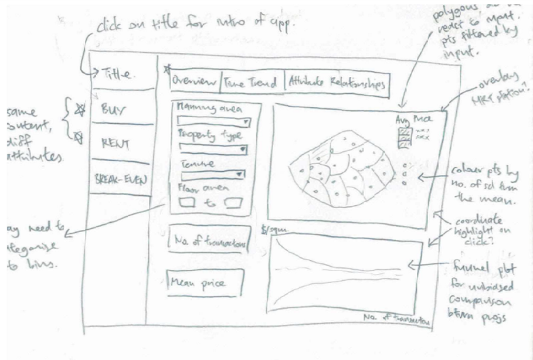
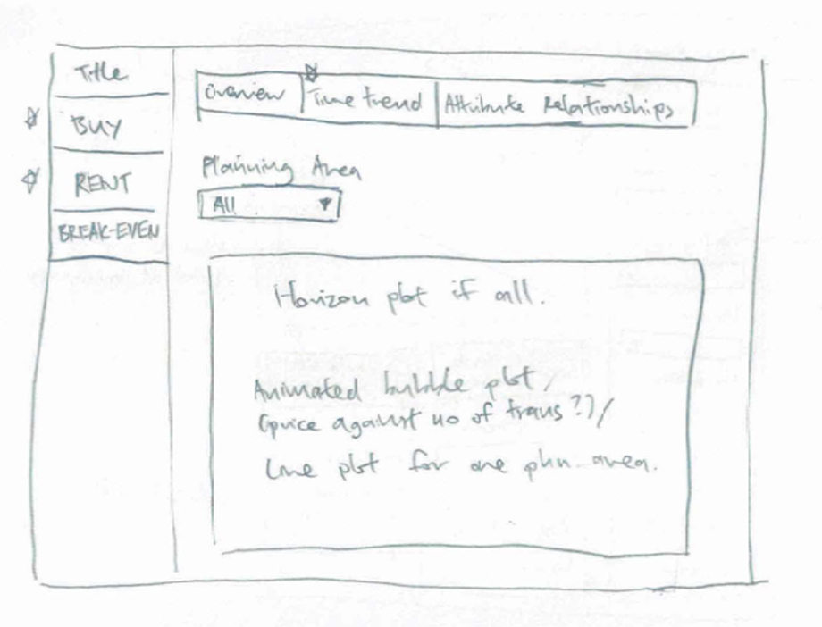
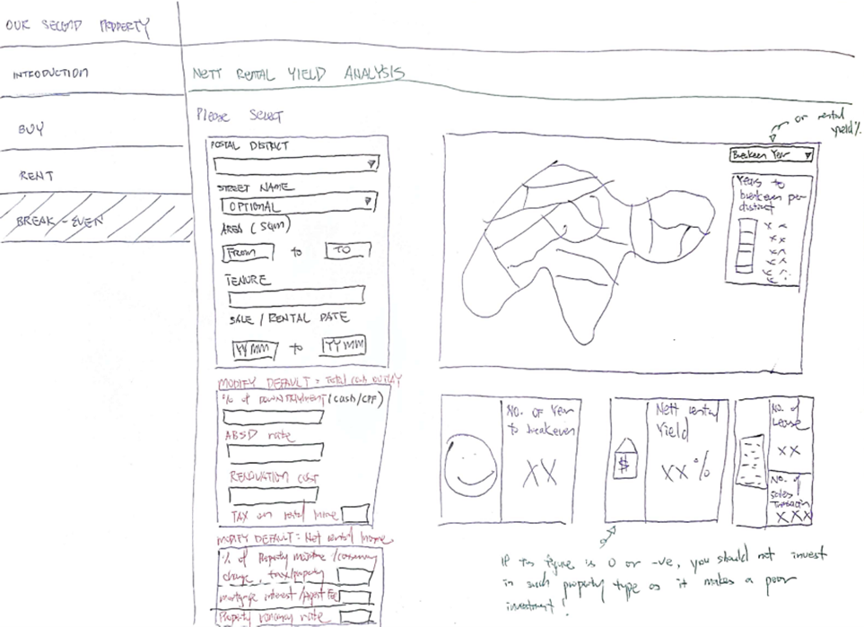
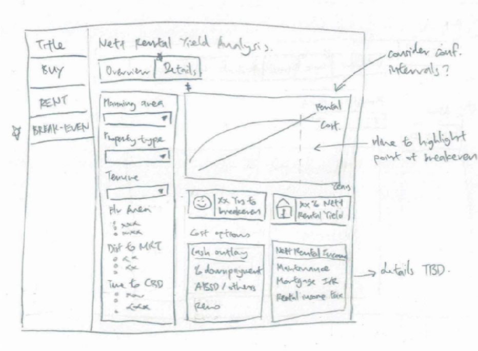

```{r setup, include=FALSE}
knitr::opts_chunk$set(echo = TRUE, warning = FALSE, message = FALSE, eval = TRUE, fig.retina = 3)
```

# 1) Motivation of the Project

It is many Singaporean's dream to own at least one rental property as part of their investment portfolio or retirement plan (us included, of course). 

However, considering the huge quantum of initial investment involved and the lack of understanding in the ever changing pricing conditions of the local property market, investing in real estate can be daunting, especially so for a first-time investor.

# 2) Problems

__a)__ Commercial, free property websites such as [Property Guru](https://www.propertyguru.com.sg/) does not provide reliable and extractable structured data for users' analysis. 

__b)__ Reliable private residential transaction data generated from the Real Estate Information System (REALIS) is __subscription-based__. This is also the case for off-the shelf statistical and visualisation tools such as SAS JMP and tableau, if users wish to perform their own unbiased property price analysis.

__c)__ __Technical knowledge is needed__ to perform accurate and reliable data-manipulation and data-wrangling, before voluminous property transaction data can be visualised to generate useful insights that is customised to each users' needs effectively.

We hope to overcome these problems by developing an app which is free, interactive, and easy-to-use. It is our desire to aid all landlord wannabes who have no technical training in data analysis to identify their their dream golden goose, based on their individual preferences such as location, property tenure, and floor area.


# 3) Our Solution

Using various R packages, the team will extract, analyse, and visualize sales and rental transaction and build an __interactive R Shiny application__ that allow layman to perform the following analysis:

__a)__ Identifying private property that is of good value to purchase (i.e. below market value of comparable properties within the same postal district);

__b)__ Identifying private property that is of with good rental yield (i.e. above market monthly rent of comparable properties within the same postal district); and

__c)__ Calculating i) rental yield and ii) number of years to “break-even” the investment by dividing sales price of a) by rental price of b). 


# 4) The Data

The following datasets will be sourced from the Real Estate Information System (REALIS). We will extract the following sales and rental transaction records in the Singapore's private residential market from years Jan 2019 to Feb 2022:

+ Sales: This dataset consists of 21 variables and 82,360 datapoints.
+ Rental: This dataset consists of 9 variables and 298,639 datapoints.


# 5) Methodology and Analytical Approach

## a) Exploratory Data Analysis (EDA) via Data Visualisation 

For this project, Exploratory Data Analysis (EDA) in the form of visualisation techniques will be applied to provide potential buyers with the ability to obtain statistically based insights through visual analytics.  By adopting visualisation concepts like visualisation of uncertainty, multivariate analysis and time series analysis to allow sense-making of the property data to help potential buyers uncover the truth while searching for their golden goose. 

## b) Sensitivity Analysis via Data Visualisation 

The property market is known to be volatile and dynamic.  There are lots of components that will affect the sales price and the rental price.  Taking into consideration of the key components like the trend in interest rate and housing cooling measures like the recent 2021 amendments to Additional Buyer's Stamp Duty (ABSD) and Total Debt Servicing Ratio (TDSR), the project will allow for sensitivity analysis to be performed via visualisation to calculate the break-even point for potential buyers to consider before they embark on investing in a property for rental yield. 

# 6) Data Visualisation Methods

In our application, the following data visualisation methods would be adopted:

+ Time Series Box Plot 
+ Violin Plot 
+ Error Plot 
+ Horizon Graph 
+ Generalized Pairs Plot 
 
In the ensuing paragraphs, we will elaborate on the application of these visualisation methods in our R Shiny Application.

## a) The Buy and Rent Tab

In the buy and rent tabs, users will be able to select district and various attributes (e.g. lease length, size etc). The selected options will be passed to a choropleth map to show spatial distribution of mean sales price/ monthly rental, a data visualization will reflect all past transactions and boxes with summary information of number of transactions, last transaction date and mean price. 

To help users find good deals, transactions that are 1 standard deviation below the mean price will be colour-coded. For the rent tab, transaction deviating from the mean by more than 1 standard deviation will also be colour-coded to indicate units with high/low rental yield. 

<center>


</center>


<center>


</center>

<center>


</center>

## b) The Break-Even Tab

For the breakeven tab, users will be able to input key property information (e.g. district, size, lease type) to get a prediction of mean breakeven time and net rental yield. These are computed based on input variables of total cash outlay (down payment, ABSD rate, renovation cost and rental income tax) and net rental income (maintenance and tax rates, mortgage interest and agent fees, and property vacancy rate) which can be modified by the user although defaults based on research will be given. 

There will also be choropleth map to show which districts tend to be better investments. It can be toggled to show either breakeven year or rental yield. A graph for cumulative cost and rental over time will also be incorporated.

<center>



</center>

<center>



</center>

# 7) R Shiny Packages

Our Application makes use of the following R Shiny packages:

+ [**tidyverse**](https://www.tidyverse.org/packages/) - A collection of R packages designed for data science 

+ [**knitr**](https://cran.r-project.org/web/packages/knitr/index.html) - An engine for dynamic report generation with R, enables integration with Markdown documents 

+ [**ggstatsplot**](https://www.rdocumentation.org/packages/ggstatsplot/versions/0.1.4) - An extension of ggplot2 package for creating graphics with details from statistical tests included in the plots 

+ [**ggHoriPlot**](https://github.com/rivasiker/ggHoriPlot) - To build horizon plots in ggplot2 

+ [**ggdist**](https://cran.r-project.org/web/packages/ggdist/index.html) - To provide primitives for visualizing distributions using 'ggplot2' that are particularly tuned for visualizing uncertainty in either a frequentist or Bayesian mode 

+ [**plotly**](https://plotly.com/r/) – To build interactive graph 


# 8) Project Management

[**Project Management**](https://en.wikipedia.org/wiki/Project_management) is the process of leading the work of a team to achieve all project goals within the given constraints.  Proper project management will entail clear definitions of the project goals, understanding the projects constraints, identifying the project risks, managing the team members and proper allocation of resource to ensure that assigned tasks can be fulfilled, proper documentation and update on the project status.   

For this project, we will be adopting the [**agile project management**](https://www.apm.org.uk/resources/find-a-resource/agile-project-management/) approach instead of the traditional waterfall approach.  This is especially critical due to the very limited timeline of this project.  Storyboarding via sketches and rapid prototyping of the app via the agile methodology will allow for fast response to changes through collaborative and iterative feedback loop between the team members.  The risk management part for this project identified are the learning curve for R Shiny and the time management of the team members for this project with other commitments from work and school.  Proper project management measures and tracking will help to mitigate the identified risk.  

Here is an overview of our project timeline:

```{r, layout="l-body-outset", fig.width=20, fig.height=20, echo=FALSE}
library(knitr)
include_graphics("data/timeline.jpg")
```


<center>
*~ We welcome any feedback and suggestion on our project. ^^ ~*


</center>
