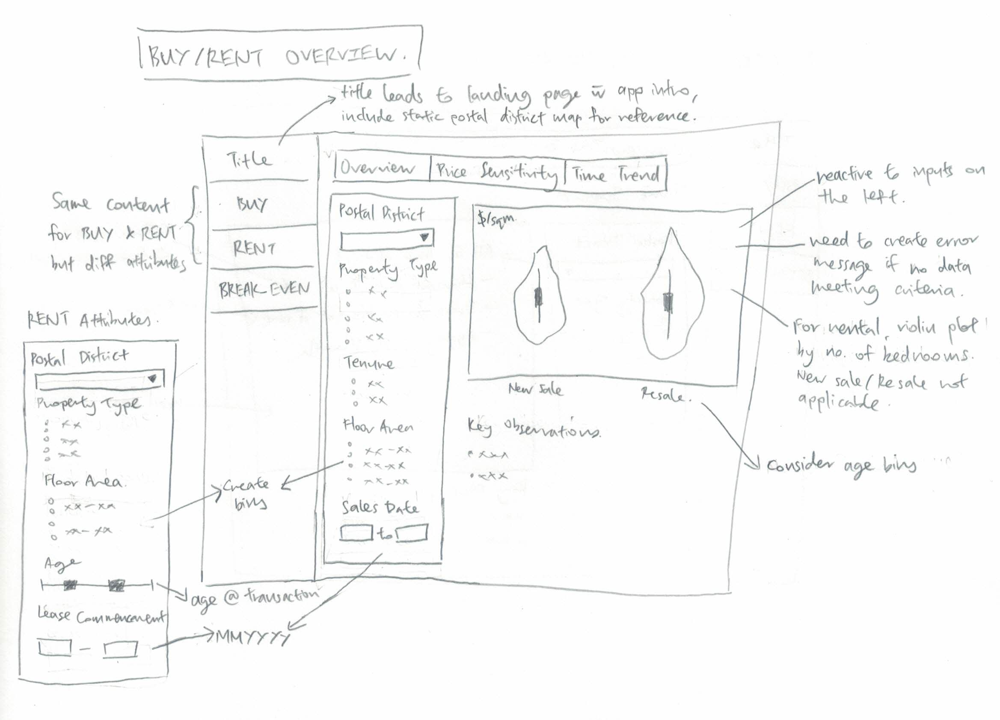
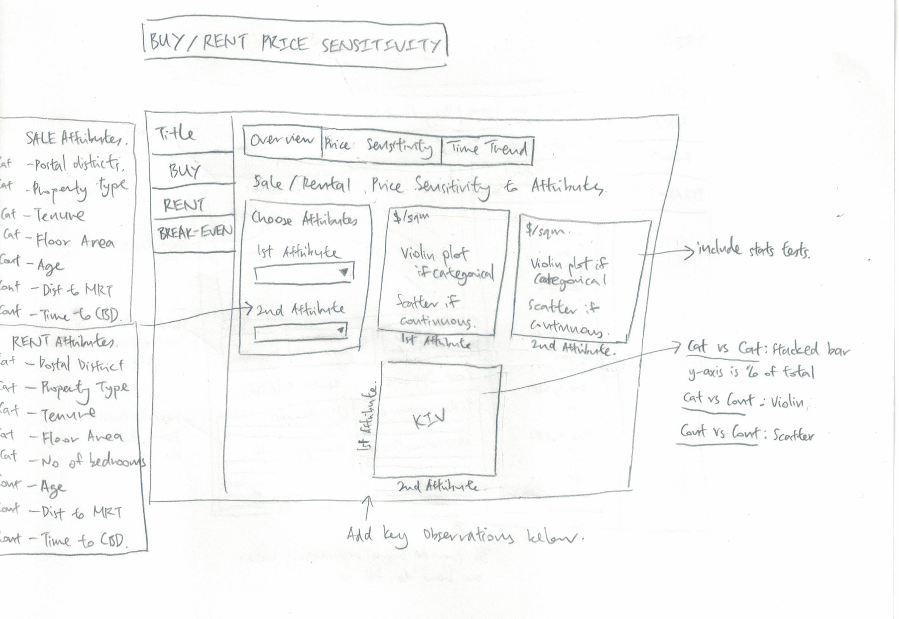
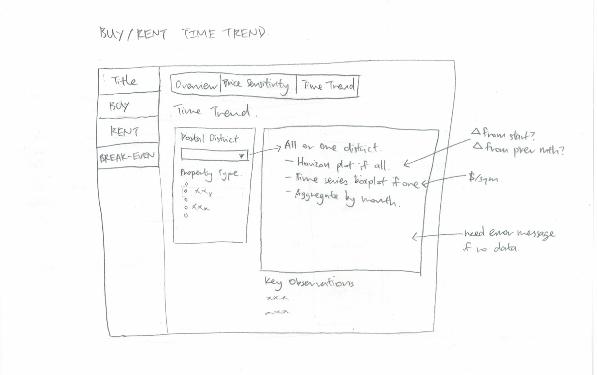
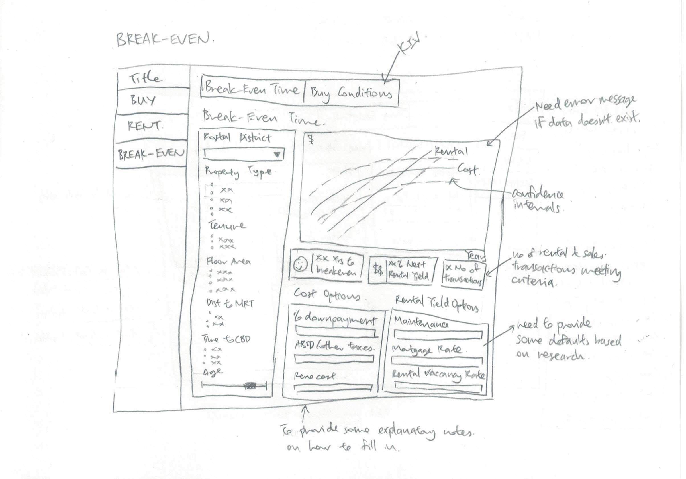
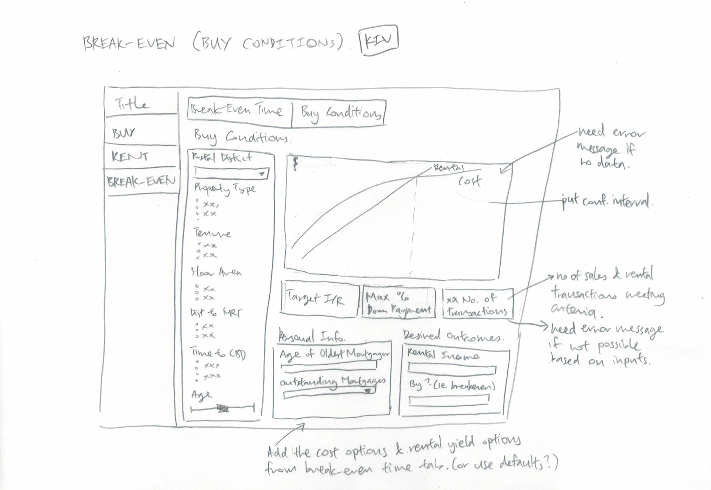

```{r setup, include=FALSE}
knitr::opts_chunk$set(echo = TRUE, warning = FALSE, message = FALSE, eval = TRUE, fig.retina = 3)
```

# 1) Motivation of the Project

It is many Singaporeans' dream to own at least one rental property as part of their investment portfolio or retirement plan (us included, of course). 

However, considering the huge  initial investment involved and the lack of understanding in the ever changing pricing conditions of the local property market, investing in real estate can be daunting, especially so for a first-time investor.

# 2) Problems

__a)__ Free commercial property websites such as [Property Guru](https://www.propertyguru.com.sg/) usually only provide simplified headline or summary statistics without showing variability. Based on such incomplete information, users may make inaccurate assumptions and estimations of potential cost or gains.

__b)__ The official source of private residential transaction data generated from the Real Estate Information System (REALIS) is __subscription-based__. This is also the case for off-the shelf statistical and visualisation tools which require minimal coding, such as SAS JMP and Tableau, if users wish to perform their own unbiased property price analysis.

__c)__ __Technical knowledge is needed__ to perform accurate and reliable data-wrangling of voluminous property transaction data to produce meaningful visualisations to draw useful insights that is customised to each users' needs effectively.

We hope to overcome these problems by developing an app which is free, interactive, and easy-to-use. It is our desire to aid all landlord wannabes who have no technical training in data analysis to identify their dream golden goose, based on their individual preferences such as location, property tenure, and floor area.


# 3) Our Solution

Using various R packages, the team will extract, analyse, and visualize sales and rental transaction and build an __interactive R Shiny application__ with visual analytics technicques to enable laymen to make more informed choices about investing in private residential property in Singapore to earn passive rental income. Users will be able to :

__a)__ Perform unbiased comparisons of sales and rental prices of their candidate property to other properties of similar characteristics;

__b)__ Gain better understanding of how the physical characteristics (.e.g. location, size) affect sales and rental prices to aid in choosing candidate properties; and

__c)__ Calculate the range of expected i) rental yield and ii) number of years to “break-even” the investment. Break-even time is found by dividing sales price by rental price while accounting for additional pertinent factors like loan conditions and taxation. 


# 4) The Data

The following datasets will be sourced from the Real Estate Information System (REALIS). We will extract the following sales and rental transaction records in the Singapore's private residential market from years Jan 2019 to Feb 2022:

+ Sales: This dataset consists of 21 variables and 82,360 datapoints.
+ Rental: This dataset consists of 9 variables and 298,639 datapoints.


# 5) Methodology and Analytical Approach

## a) Exploratory Data Analysis (EDA) via Data Visualisation 

For this project, Exploratory Data Analysis (EDA) in the form of visualisation techniques will be applied to provide potential buyers with the ability to obtain statistically based insights through visual analytics.  By adopting visualisation concepts like visualisation of uncertainty, multivariate analysis and time series analysis to allow sense-making of the property data to help potential buyers make more informed choices while searching for their golden goose. 

## b) Sensitivity Analysis via Data Visualisation 

The property market is known to be volatile and dynamic. There are many components that affect sales price and rental prices. Taking into consideration of the key components like the trend in interest rate and housing cooling measures like the recent 2021 amendments to Additional Buyer's Stamp Duty (ABSD) and Total Debt Servicing Ratio (TDSR), the project will allow for sensitivity analysis to be performed via visualisation to calculate the break-even point for potential buyers to consider before they embark on investing in a property for rental yield. 

# 6) Data Visualisation Methods

In our application, the following data visualisation methods would be adopted:

+ Violin Plot 
+ Time Series Box Plot 
+ Horizon Graph 
+ Generalized Pairs Plot 
+ Line Plot with Confidence Intervals

In the ensuing paragraphs, we will elaborate on the application of these visualisation methods in our R Shiny Application.

## a) The Buy and Rent Tab

The buy and rent are intended to help users understand the property market better and provide the tools to make unbiased comparisons.

In the overview tab, users will be able to select various attributes attributes (e.g. postal district, building lease, size etc). The selected options will be passed to a violin plot to show variation of sales/rental prices per sqm. The transactions will be grouped into new sale and resale (further split into age bins) for buy, and by number of bedrooms for resale.



In the price sensitivity tab, users will be able to select up to two attributes to view their relationship against sale/rental price in $/sqm. The visualisations to be used are violin plot if categorical and scatter plot with trendline if continuous. The results of statistical tests will be included in the graphs. We will also share some key oberservations about the key attributes that affect price below the plotting area.

If time permits, we will include an additional third plot below to let the user explore the relationship between the 2 chosen attributes. 3 types of charts will be needed: (a) stacked proportional bar graph for categorical against categorical, (b) violin plot for categorical against continuous and (c) scatterplot for continuous against continuous.



The time trend tab will show time trends of sales/rental prices ($/sqm). Users can choose 2 input fields: postal district and property type. For the postal district option, users can choose to view all postal disticts or view them one at a time. If the "all districts" option is chosen, a horizon plot will be shown. If a single district is chosen, a time series box plot will be shown. The data will be aggregated by month. Unlike the typical time series line graph, time series box plot shows hows the entire distribution of price changes over time.



## b) The Break-Even Tab

The aim of the break-even tab is to enable buyers to estimate how long it will take to break-even on their investment.

For the breakeven time tab, users will be able to input values for proerty attributes (e.g. postal district, building lease, size etc) to get a prediction of the distribution of breakeven time and net rental yield. A line graph of rental and cost ($) against time with confidence intervals will be shown on the right to show total cost and rental accrued over time until the break-even point is finally reached. The confidence intervals are crucial to show potential buyers some of the risk associated in purchsing a property to rent out.

Dashboard boxes of the key information will be shown below the graph to synthesise some key information: approximate range of years to break-even, nett rental yield and lastly the number of transactions used in computing this information.

Initially, the cost and rental would computed based on some default values (obtained through research) affect of total cash outlay (e.g. down payment, ABSD rate, renovation cost and rental income tax) and net rental income (e.g. maintenance and tax rates, mortgage interest and agent fees, and property vacancy rate). The user can further modify these values based on their personal projections. While some of these values, especially mortgage interest rate, could vary greatly over time in real life and should be accounted for in the break-even model to represent risk more accurately, it will not be included in this analysis given the time frame provided.



If time permits, we will include an additional tab to compute favourable buy conditions.

This tab is intended to be the reverse of the break-even time tab. Users will be able to find out certain favourable buy conditions (target maximum interest rate, maximum downpayment percent) based on certain desired outcomes (e.g. expected future rental income, target time to breakeven).

As per the break-even time tab, users will be need to input values for property attributes (e.g. postal district, building lease, size etc). Users will also need to input their desired outcomes and some personal information (e.g. age of oldeest mortgagor and number of outstanding mortgages) which affect the allowable loan amounts

A line graph of rental and cost ($) against time with confidence intervals will be shown to show total cost and rental accrued over time until the desired break-even point is finally reached. An additional reference line of time period when loan is paid off will need to be shown as well.



# 7) R Shiny Packages

Our Application makes use of the following R Shiny packages:

+ [**tidyverse**](https://www.tidyverse.org/packages/) - A collection of R packages designed for data science 

+ [**knitr**](https://cran.r-project.org/web/packages/knitr/index.html) - An engine for dynamic report generation with R, enables integration with Markdown documents 

+ [**ggstatsplot**](https://www.rdocumentation.org/packages/ggstatsplot/versions/0.1.4) - An extension of ggplot2 package for creating graphics with details from statistical tests included in the plots 

+ [**ggHoriPlot**](https://github.com/rivasiker/ggHoriPlot) - To build horizon plots in ggplot2 

+ [**ggdist**](https://cran.r-project.org/web/packages/ggdist/index.html) - To provide primitives for visualizing distributions using 'ggplot2' that are particularly tuned for visualizing uncertainty in either a frequentist or Bayesian mode 

+ [**plotly**](https://plotly.com/r/) – To build interactive graph 


# 8) Project Management

[**Project Management**](https://en.wikipedia.org/wiki/Project_management) is the process of leading the work of a team to achieve all project goals within the given constraints.  Proper project management will entail clear definitions of the project goals, understanding the projects constraints, identifying the project risks, managing the team members and proper allocation of resource to ensure that assigned tasks can be fulfilled, proper documentation and update on the project status.   

For this project, we will be adopting the [**agile project management**](https://www.apm.org.uk/resources/find-a-resource/agile-project-management/) approach instead of the traditional waterfall approach.  This is especially critical due to the very limited timeline of this project.  Storyboarding via sketches and rapid prototyping of the app via the agile methodology will allow for fast response to changes through collaborative and iterative feedback loop between the team members.  The risk management part for this project identified are the learning curve for R Shiny and the time management of the team members for this project with other commitments from work and school.  Proper project management measures and tracking will help to mitigate the identified risk.  

Here is an overview of our project timeline:

```{r, layout="l-body-outset", fig.width=20, fig.height=20, echo=FALSE}
library(knitr)
include_graphics("data/timeline.jpg")
```


<center>
*~ We welcome any feedback and suggestion on our project. ^^ ~*


</center>
